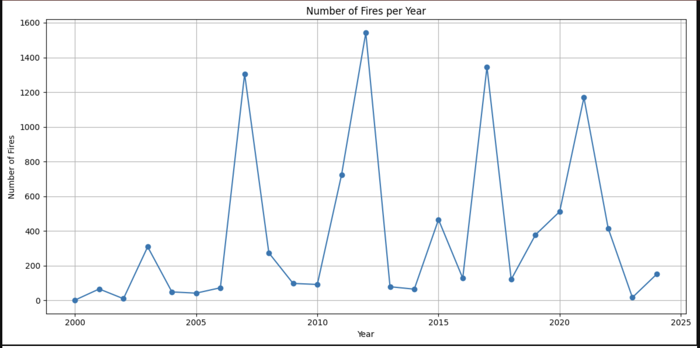
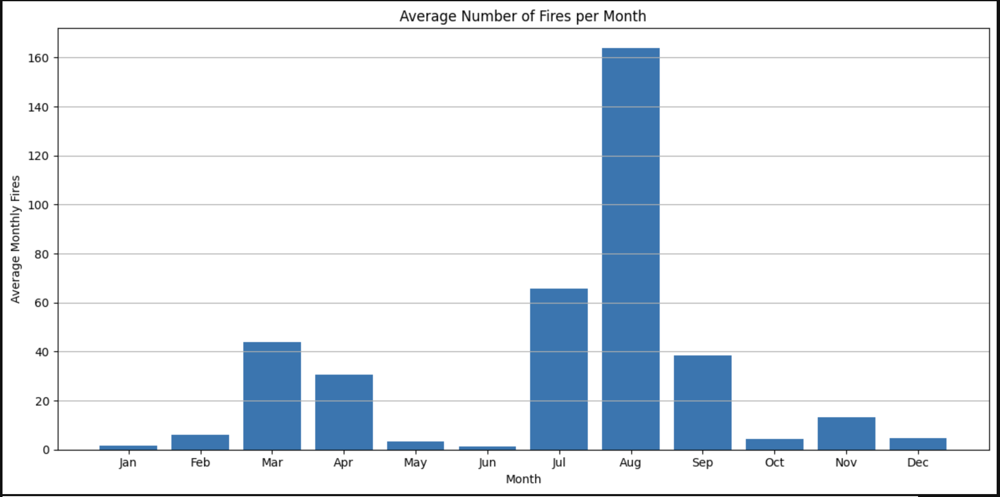
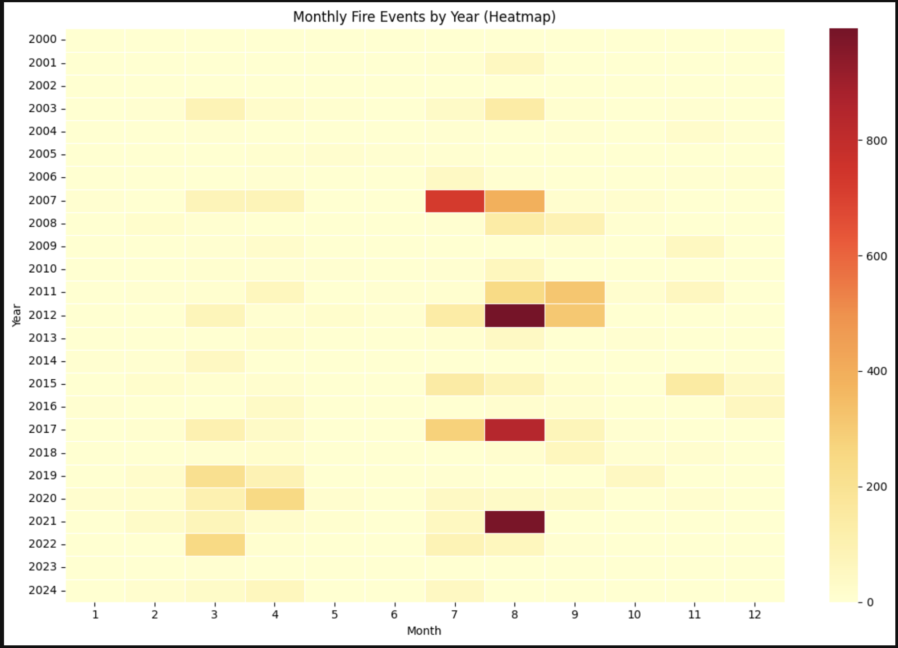

# Fire Data Analysis Repository

This repository contains a Python script that processes and visualizes fire event data derived from satellite observations. The analysis uses data from the **MODIS C6.1** sensor provided by [NASA FIRMS](https://firms.modaps.eosdis.nasa.gov). The dataset spans from **2000-11-01** to **2025-01-16** and covers the area of interest: **Montenegro**.

---

## Overview

The script executes the following workflow:
1. **Data Loading:** Loads the CSV data with robust error handling.
2. **Data Preprocessing:** Cleans the dataset by removing invalid entries and converts date-time fields.
3. **Data Summarization:** Aggregates fire events to generate annual and monthly statistics.
4. **Visualization:** Produces three visualizations:
   - **Line Chart:** Number of fires per year.
   - **Bar Chart:** Average number of fires per month.
   - **Heatmap:** Distribution of fire events by year and month.

---

## Data Source

The fire event data is provided by NASA FIRMS and has the following attributes:
- **Data Source:** MODIS C6.1  
- **Start Date:** 2000-11-01  
- **End Date:** 2025-01-16  
- **Output Format:** CSV  
- **Area of Interest:** Montenegro

**Access the original data at:** [NASA FIRMS](https://firms.modaps.eosdis.nasa.gov)

---

## Visualizations

The generated visualizations are based on the satellite data and summarize the fire events across different time scales.

### Number of Fires per Year


### Average Number of Fires per Month


### Monthly Fire Events by Year (Heatmap)


---

## Installation

Ensure you have **Python 3.x** installed. To install the required packages, run:

```bash
pip install -r requirements.txt
```

## License
### Code License
This project is licensed under the MIT License.

### Data License

The fire data used in this project is provided by NASA FIRMS and is in the public domain (in accordance with U.S. government policies). However, proper attribution is required. When using or redistributing the data, please include the following details:

Data Source     : MODIS C6.1
Start Date      : 2000-11-01
End Date        : 2025-01-16
Output Format   : CSV
Area of Interest: Montenegro
Source          : https://firms.modaps.eosdis.nasa.gov

Feel free to contribute by opening issues or submitting pull requests.
For any questions or suggestions, please contact me via https://andrewn.name

